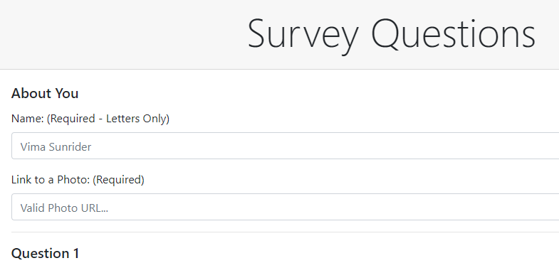

# FriendFinder

##### Homework 13 - Node & Express Servers

Friend Finder is a web application that lives up to it's name... It is a compatibility-based web application for matching two people with similar personalities, which are ascertained by a rigorous ten-question survey.  The user answers the ten questions, and the application analyzes the answers and responds with the best match for the user.


 

## Getting Started

These instructions will get you a copy of the project up and running on your local machine for development and testing purposes.  See deployment for notes on how to deploy the project on a live system.

### Prerequisites

In order to install and run FriendFinder you will need the following:

```
Node.js
Express.js
```

### Installing

You will need to do the following steps after cloning the repo to your device in order to ensure that it works properly.

To ensure Node.js is running within the package and configure all modules for use:

```
npm install (or npm install -y)
```

This should install all the requisite modules, but just in case, the only necessary one is:

```
express (npm install -s express)
```

## Running Friend Finder

Friend Finder is run locally using Node.js, to begin the server simply path into the root folder for the application and run:

```
node server.js
```

This starts the server which is currently set to run at PORT 8080 (http://localhost:8080/).
That is really all there is to starting the application running, after that it is then all done in your browser.

### Notes

In the test folder of the repository there is a simple.js, which is a solution that works and runs, but only checks to ensure that no field has been left blank, whereas the one in the survey.html file uses Regular Expressions (RegEx) to ensure that the user has properly entered text for a name, and also checks to ensure that they have entered a valid image URL for their photo, in addition to ensuring all the quiz questions are answered.

## Deployment

I personally have this application deployed using Heroku, simply by creating an app within Heroku and then linking my GitHub repository to it and deploying the main branch, which is a very simply and painless process.

## Built With

* [Node.js](https://nodejs.org/en/) - Runtime Environment
* [Express.js](https://expressjs.com/) - Web Framework
* [Bootstrap](https://getbootstrap.com/) - CSS Framework
* [Font Awesome](https://fontawesome.com/) - Icons
* [gitignore.io](https://www.gitignore.io/) - For creating the .gitignore
* [WebStorm](https://www.jetbrains.com/webstorm/) - IDE

## Authors

* **Dalton Ricker** - *Primary Author* - [SasquatchXYZ](https://github.com/SasquatchXYZ)

## Acknowledgments
* Many thanks to my instructors & TAs, as well as the O'Reilly reference books.